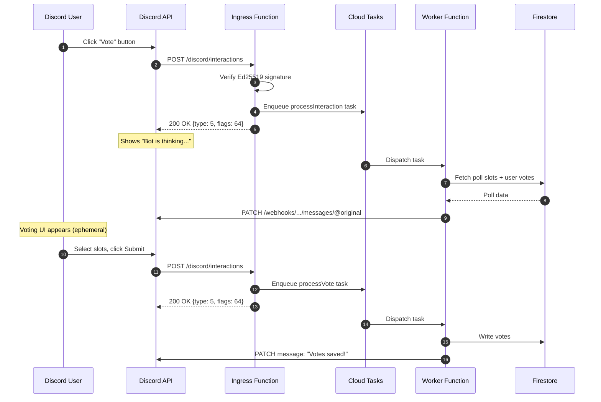

> [!WARNING]
> This document is marked **stale**. Verify against current code and newer docs before relying on it.

# Discord Bot Feature Design Doc

## Summary
Add a Discord bot integration that lets questing groups connect a server + channel, receive poll updates, and vote from Discord. Votes cast in Discord apply to the same poll data as the web UI (preferred/feasible), with full support for edits, reopen, and finalization.

This design avoids Message Content privileged intent by using Discord Interactions (slash commands + message components) and the bot's own messages. It uses Discord IDs (guild, channel, user) for stable identity mapping and supports OAuth2-based identity linking for Quest Scheduler users.

## Goals
- Allow a questing group to connect a Discord server + channel to receive poll updates.
- Allow authenticated users to cast and update poll votes directly in Discord.
- Keep Discord state consistent with poll state, including edits, re-open, and finalization.
- Avoid privileged intents and message content scraping; use Interactions and components.
- **Zero-cost operation**: Leverage Firebase/Google Cloud free tiers (Cloud Functions, Cloud Tasks) to maintain $0/month running costs for typical usage, while still enabling billing (Blaze) for deployment.

## Non-Goals (for this phase)
- Creating polls directly from Discord.
- Finalizing a poll from Discord.
- DM-only voting flows (optional later).

## Product UX Overview
- A questing group admin runs a Discord slash command (or uses a web UI link) to connect a Discord channel to the questing group.
- When a poll includes that questing group, the bot posts an interactive poll card into the connected channel.
- Users vote in Discord via a button that opens an ephemeral voting UI (select menus/buttons).
- Votes sync to the poll in Quest Scheduler and are visible in the web UI.
- When the poll is edited, reopened, or finalized, the bot edits or posts updates in Discord.
- When a finalized poll is reopened, the bot posts a notification (with the configured notify role) so voters know to revisit.

## Discord Platform Constraints & Architecture
- **Message content is a privileged intent**: Avoid reading messages. Use Interactions.
- **3-Second Response Deadline**: Discord requires an initial response within 3 seconds.
- **Interaction token lifetime**: Follow-ups and edits must be sent within ~15 minutes.
- **CPU Allocation**: Cloud Run request-based billing allocates CPU only during request processing, so background work after the response is not guaranteed.
- **Solution**: The **"Always Defer + Async Task"** pattern.
    1.  **Ingress Function**: Receives interaction -> Verifies Signature -> Enqueues Cloud Task -> Responds `DEFERRED_CHANNEL_MESSAGE_WITH_SOURCE` (type 5) immediately.
    2.  **Worker Function (Cloud Task)**: Executes the logic (DB writes, Discord API calls) -> Edits the original deferred message with the result.

### High-Level Components
1.  **Interaction Ingress (Cloud Function)**
    - Public HTTPS endpoint.
    - Verifies Ed25519 signature (CRITICAL security step).
    - Enqueues a **Cloud Task** for the actual work.
    - Returns `200 OK` with "Deferred" type immediately (< 500ms).

2.  **Async Worker (Cloud Function triggered by Cloud Task)**
    - Processes the vote/command.
    - Writes to Firestore.
    - Calls Discord API to update the message or send a follow-up.
    - Retries automatically on transient errors (built-in Cloud Task feature).
    - Has full CPU access (not throttled like post-response code).

**Cloud Tasks Note**: Task payloads are billed in 32KB chunks and the maximum task size is 100KB. Keep payloads small:
- Let Cloud Tasks auto-generate task IDs (don't use custom names)
- Store only essential interaction fields in the task payload

3.  **Quest Scheduler Backend**
    - Stores Discord linkage (guild/channel/group mapping).
    - Stores Discord user mappings.

4.  **Quest Scheduler Web App**
    - UI to manage Discord integration.
    - OAuth2-based Discord user linking flow.

## Authentication + Identity Linking
### Server/Channel Link
- Only questing group owners/admins can link a Discord channel.
- **Bootstrap linking (required)**: Linking must start from a Quest Scheduler identity. Use a two-step flow:
  1. In Quest Scheduler web UI, a group admin generates a **one-time link code** for the group.
  2. In Discord, they run `/qs link-group <code>` in the target channel. The bot validates the code, checks channel permissions, and links the group.
- The bot verifies admin permissions on the guild/channel (Manage Channels or Administrator).

### User Link
Each Quest Scheduler user must link their Discord user ID so that votes can be attributed correctly.

- **OAuth2 link flow (recommended)**: user clicks "Link Discord" in settings, authorizes via Discord, and backend stores `discordUserId`.
- **Slash command linking**: user runs `/qs link` and the bot returns a one-time code; user enters the code in Quest Scheduler to complete linking.

**One-time code requirements (link + group link):**
- TTL: 10 minutes.
- Store hashed codes server-side.
- Rate limit per user and per IP.
- Max 5 attempts per code; delete on success or expiration.
- OAuth2 scope: `identify` only. Use Authorization Code flow with a `state` parameter and store tokens server-side (never in the client).

## Data Model Additions
```
questingGroups/{groupId}:
  discord:
    guildId
    channelId
    channelName
    linkedAt
    linkedByUserId
    notifyRoleId   # role id to notify on finalization, or "everyone" / "none"

schedulers/{schedulerId}:
  discord:
    messageId
    channelId
    guildId
    lastPostedAt
    lastUpdatedAt
    lastStatus
    lastSyncedHash
    finalizedNotifiedAt
    pendingSync
    pendingSyncAt
    pendingSyncError

schedulers/{schedulerId}/votes/{userId}:
  source: "web" | "discord"
  lastVotedFrom: "web" | "discord"

users/{uid}:
  discord:
    userId
    username
    globalName
    linkedAt
    linkSource   # "oauth" | "slash"

discordUserLinks/{discordUserId}:
  qsUserId
  linkedAt

discordLinkCodes/{codeId}:
  codeHash
  type: "user-link" | "group-link"
  uid
  groupId
  createdAt
  expiresAt
  attempts

discordVoteSessions/{sessionId}:
  schedulerId
  discordUserId
  qsUserId
  preferredSlotIds
  feasibleSlotIds
  createdAt
  updatedAt
  expiresAt   # TTL ~15 minutes

discordInteractionIds/{interactionId}:
  createdAt
  completedAt
  status: "processing" | "done"
  expiresAt   # TTL ~60 minutes
```

## API Contracts

### Discord → Bot Service (Interaction Ingress)
**POST `/discord/interactions`**

**Signature Verification (CRITICAL)**:
Discord sends two headers that MUST be verified before processing:
- `X-Signature-Ed25519`: The Ed25519 signature
- `X-Signature-Timestamp`: Unix timestamp of the request

```javascript
import { verifyKey } from 'discord-interactions';

// MUST use raw body (not parsed JSON) for verification
const isValid = await verifyKey(
  req.rawBody,
  req.headers['x-signature-ed25519'],
  req.headers['x-signature-timestamp'],
  process.env.DISCORD_PUBLIC_KEY
);

if (!isValid) {
  return res.status(401).send('Invalid signature');
}
```

**Security notes**:
- Discord periodically sends invalid signatures to test your endpoint
- If signature verification fails, Discord can remove your interactions URL
- 10,000 invalid requests in 10 minutes triggers a 24-hour Cloudflare ban

**Response**: ALWAYS return a deferred response within 3 seconds.
- Use `type: 5` (`DEFERRED_CHANNEL_MESSAGE_WITH_SOURCE`) for most interactions.
- Set `flags: 64` only when the response should be ephemeral.
- For component interactions that only update the source message (non-ephemeral), `type: 6` (`DEFERRED_UPDATE_MESSAGE`) is acceptable.
- `PING` must return `type: 1` (`Pong`) synchronously.

**Action**: Enqueue `processDiscordInteraction` Cloud Task BEFORE sending response.

### Async Worker (Cloud Task)
**Task Handler: `processDiscordInteraction`**
- Payload: `{ interaction_id, token, application_id, data, guild_id, channel_id, member, user, ... }`
- Logic:
  - If `custom_id` == "vote_btn": Fetch slots -> Call Discord API to edit original response with Select Menus.
  - If `custom_id` == "submit_vote": Write to Firestore -> Call Discord API to edit original response ("Votes saved").
  - If token is older than 15 minutes, skip editing the original response and log a warning.

## Data Integrity & Authorization Checks
- Reject interactions where `application_id` does not match the configured Discord app.
- Require `guild_id` + `channel_id` to match the linked questing group for the poll.
- Require a linked Discord user; block if `discordUserId` already links to another QS user.
- Require the linked user's email to be a participant on the poll.
- Reject votes for removed slots or when the poll is finalized/locked.
- Enforce **Preferred ⇒ Feasible** on every write.

## Discord Voting UX
### Posting the Poll Card
- Post a single “canonical” poll message per poll.
- **Timezones**: Use Discord timestamps `<t:unix:F>` for localized display.

### Voting Flow (Components)
1. User clicks "Vote" button.
2. Bot responds "Thinking..." (Interaction Deferral).
3. **Async Task** fetches data and edits the response to show the **Ephemeral Voting UI**:
   - Multi-select **Preferred** (max 25).
   - Multi-select **Feasible** (max 25).
   - "Submit" Button.
   - "Clear my votes" Button (Resets selection).
   - "None work for me" Button (Explicit "No").
4. User submits.
5. Bot updates ephemeral message: "Votes saved! ✅"

**Pagination**: If slots > 25, use "Next Page" buttons that replace the ephemeral content with the next set of options.
**Component limits**:
- `custom_id` must be unique per component (max 100 chars).
- A message can have 5 action rows max.
- A string select menu supports 25 options and `max_values` up to 25.
**Pagination state**: Store per-user selections across pages in a short-lived Firestore doc keyed by `interaction_id` + `user_id`, and expire it after ~15 minutes.

**Low-cost fallback**: If a poll exceeds UI limits by a large margin (e.g., >10 dates or >100 slots), show a single "Vote on Web" button to avoid heavy pagination and extra Firestore reads/writes.

## Event Handling Strategy
Use **Firestore Triggers** to enqueue Cloud Tasks for poll updates.
- **Debounce**: Use a `lastSyncedHash` and a 5-second delay on the Cloud Task to prevent rapid-fire edits (e.g., during a drag-and-drop reorder).
- **Finalization announcement**: When status transitions to `FINALIZED`, post a new channel message with the winning time and mention `notifyRoleId` (including the `"everyone"` default).
- **No-ping option**: If `notifyRoleId` is `"none"`, post the announcement without any mentions.
- **Delete/unlink updates**: If a poll is deleted or unlinked from a channel, edit the existing Discord message to show the new status (e.g., DELETED or UNLINKED) and disable voting.

## Idempotency & Retries
- Discord may retry interactions; Cloud Tasks will retry on transient failures.
- Store processed `interaction_id` values for a short TTL to prevent double vote writes.
- Design worker handlers to be idempotent (last-write-wins for votes).

## Implementation Phases
1. **Phase 1: Foundation**: Set up Cloud Functions V2 + Cloud Tasks. Implement `/qs link-group` and Poll Card posting.
2. **Phase 2: Voting**: Implement the Voting UI (ephemeral components), Pagination, and Vote Writes.
3. **Phase 3: Polish**: Error handling, "None work for me", and Debouncing.

## Tech Stack & Cost
- **Runtime**: Node.js 22 (Cloud Functions 2nd Gen).
- **Libraries**:
    - `discord-interactions` (v4.4.0+): Official Discord package for signature verification.
    - `@discordjs/rest`: For API calls with automatic rate limit handling.
    - `firebase-admin`: For Firestore/Auth.
    - `firebase-functions` (v2): For Cloud Functions 2nd Gen + Cloud Tasks integration.
- **Cost Analysis**:
    - **Cloud Run (Functions 2nd gen)**: Free tier includes 2M requests/month.
    - **Cloud Tasks**: Free tier (1M tasks/month).
    - **Firestore**: Free tier (50k reads/20k writes per day).
    - **Total**: **$0/month** for expected usage, but requires enabling billing (Blaze) to deploy functions and use Cloud Tasks.
## Design Decisions
- **Always Defer + Cloud Tasks**: Chosen to bypass Cold Start timeouts (3s limit) and CPU throttling issues in serverless, while maintaining $0 cost (avoiding "min instances").
- **Ephemeral UI**: Prevents channel spam.
- **Separate Ingress/Worker**: Decouples high-speed ingress (Discord requirement) from slower business logic.

## Error Handling
All errors shown to Discord users should be actionable:

| Error Condition | User Message |
|-----------------|--------------|
| User not linked | "Link your Discord account to Quest Scheduler to vote. Visit questscheduler.cc/settings" |
| Poll not found | "This poll no longer exists. It may have been deleted." |
| Poll finalized | "Voting is closed for this session." |
| Stale slots | "The poll was updated. Please tap Vote again to see the latest times." |
| User not authorized | "You're not a participant in this poll. Ask the organizer to invite you." |
| Generic error | "Something went wrong. Please try again or vote on the web." |

## Rate Limiting
- **Use `@discordjs/rest`**: Handles Discord's bucket-based rate limits automatically.
- **Global limits**: 50 requests/second per bot; 10,000 invalid requests in 10 min = 24h ban.
- **Interaction webhooks**: Share the same rate limit properties as normal webhooks.
- **Debounce poll updates**: Use Cloud Tasks with `scheduleDelaySeconds: 5` to coalesce rapid edits.

## Bot Permissions
Minimal permissions bitfield: **2147568640**

| Permission | Bit | Purpose |
|------------|-----|---------|
| View Channel | 1024 | See the linked channel |
| Send Messages | 2048 | Post poll cards |
| Embed Links | 16384 | Rich poll card formatting |
| Read Message History | 65536 | Edit own messages |
| Use Application Commands | 2147483648 | Slash commands |

**Note**: "Use Application Commands" is a user permission. You can omit it from the bot's permission bitfield and instead configure `default_member_permissions` on each slash command to control who can invoke them.

Install URL:
```
https://discord.com/api/oauth2/authorize?client_id={CLIENT_ID}&scope=bot%20applications.commands&permissions=2147568640
```

## Environment Variables / Secrets
Add to Firebase Secret Manager (use `defineSecret()` from `firebase-functions/params`):

| Secret | Purpose |
|--------|---------|
| `DISCORD_APPLICATION_ID` | Bot application ID from Discord Developer Portal |
| `DISCORD_PUBLIC_KEY` | For Ed25519 signature verification |
| `DISCORD_BOT_TOKEN` | For Discord API calls |
| `DISCORD_CLIENT_ID` | For OAuth2 flow |
| `DISCORD_CLIENT_SECRET` | For OAuth2 token exchange |

```javascript
import { defineSecret } from 'firebase-functions/params';

const discordPublicKey = defineSecret('DISCORD_PUBLIC_KEY');
const discordBotToken = defineSecret('DISCORD_BOT_TOKEN');

export const discordIngress = onRequest({
  secrets: [discordPublicKey, discordBotToken],
  // ...
}, handler);
```

## Firestore Rules Updates
Add to `firestore.rules`:
```javascript
// Discord user links - admin SDK only
match /discordUserLinks/{discordUserId} {
  allow read, write: if false;
}

// One-time link codes - admin SDK only
match /discordLinkCodes/{codeId} {
  allow read, write: if false;
}

// Protect discord fields on users (add to existing protectedUserFieldsUnchanged)
// "discord" should be in the protected keys list
```

## Open Questions
- **Threads**: Blocked for Phase 1.
- **Multi-channel**: 1:1 mapping for Phase 1.

## Codebase Integration
- **`functions/src/discord/ingress.js`**: Interaction handler (signature verification, task enqueue, deferred response).
- **`functions/src/discord/worker.js`**: Cloud Task handler (Firestore ops, Discord API calls).
- **`functions/src/triggers/scheduler.js`**: Firestore triggers for poll updates.

## Why Cloud Tasks (Not Inline Async)

**The Problem**: Cloud Run request-based billing allocates CPU only while the request is being handled. Once the response is sent, background work is **not guaranteed** to run to completion.

**The Solution**: Enqueue a Cloud Task BEFORE sending the response. The task runs in a separate function invocation with full CPU access.

```
┌─────────────────┐     ┌─────────────────┐     ┌─────────────────┐
│  Discord API    │────▶│ Ingress Function │────▶│  Cloud Tasks    │
│                 │     │ (verify, enqueue,│     │  Queue          │
│                 │◀────│  respond type:5) │     │                 │
└─────────────────┘     └─────────────────┘     └────────┬────────┘
                                                         │
                                                         ▼
┌─────────────────┐     ┌─────────────────┐     ┌─────────────────┐
│  Discord API    │◀────│ Worker Function  │◀────│ Task Dispatch   │
│ (edit message)  │     │ (Firestore ops,  │     │                 │
│                 │     │  Discord API)    │     │                 │
└─────────────────┘     └─────────────────┘     └─────────────────┘
```

**Alternatives considered**:
- Cloud Run instance-based billing (always-allocated CPU): Works but adds ongoing cost
- Pub/Sub: Similar reliability, slightly more complex

## Sequence Diagram: Vote from Discord


