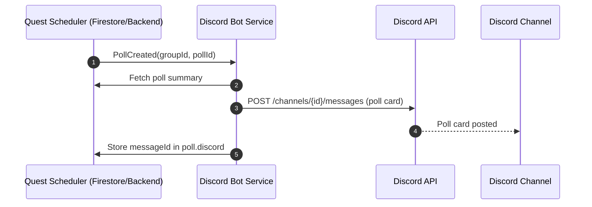
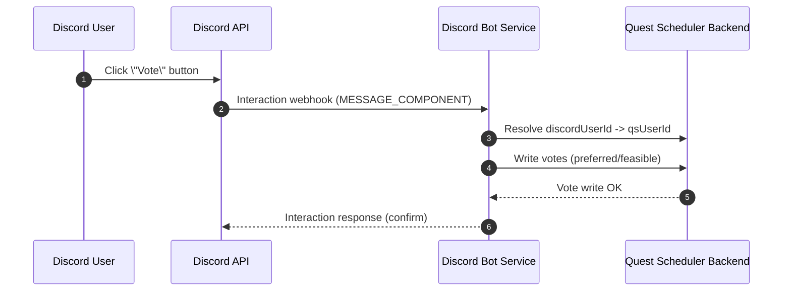
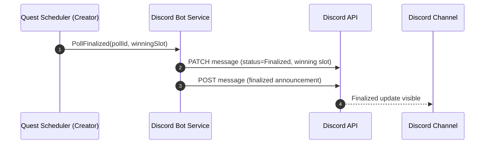

# Discord Bot Feature Design Doc

## Summary
Add a Discord bot integration that lets questing groups connect a server + channel, receive poll updates, and vote from Discord. Votes cast in Discord apply to the same poll data as the web UI (preferred/feasible), with full support for edits, reopen, and finalization.

This design avoids Message Content privileged intent by using Discord Interactions (slash commands + message components) and the bot's own messages. It uses Discord IDs (guild, channel, user) for stable identity mapping and supports OAuth2-based identity linking for Quest Scheduler users.

## Goals
- Allow a questing group to connect a Discord server + channel to receive poll updates.
- Allow authenticated users to cast and update poll votes directly in Discord.
- Keep Discord state consistent with poll state, including edits, re-open, and finalization.
- Avoid privileged intents and message content scraping; use Interactions and components.

## Non-Goals (for this phase)
- Creating polls directly from Discord.
- Finalizing a poll from Discord.
- DM-only voting flows (optional later).

## Product UX Overview
- A questing group admin runs a Discord slash command (or uses a web UI link) to connect a Discord channel to the questing group.
- When a poll includes that questing group, the bot posts an interactive poll card into the connected channel.
- Users vote in Discord via a button that opens an ephemeral voting UI (select menus/buttons).
- Votes sync to the poll in Quest Scheduler and are visible in the web UI.
- When the poll is edited, reopened, or finalized, the bot edits or posts updates in Discord.

## Discord Platform Constraints (Research Highlights)
- Message content is a privileged intent for verified bots; Discord recommends using Interactions (slash commands, buttons, select menus) instead of reading message content. citeturn1search4
- Privileged intents (presence, guild members, message content) are gated for verified apps; avoid them unless strictly needed. citeturn1search0
- Message components provide interactive UI elements (e.g., buttons/select menus) and require `custom_id` for handling user interactions. citeturn0search3

## Architecture
### High-Level Components
1. **Discord Bot Service** (Cloud Function or separate service)
   - Receives interactions (slash commands, component clicks).
   - Sends/edits messages in Discord channels.
   - Calls Quest Scheduler backend to read polls and record votes.

2. **Quest Scheduler Backend**
   - Stores Discord linkage (guild/channel/group mapping).
   - Stores Discord user mappings (Quest Scheduler user -> Discord user ID).
   - Exposes endpoints to create/update poll messages and apply votes.

3. **Quest Scheduler Web App**
   - Adds UI in questing group settings to manage Discord integration.
   - Provides a secure OAuth2-based Discord user linking flow.

### Interaction Delivery Method
Use an **Interaction webhook endpoint** (recommended) and keep the bot service stateless for commands and component interactions. Verify incoming requests using Discord’s public key before processing. citeturn0search5

## Authentication + Identity Linking
### Server/Channel Link
- Only questing group owners/admins can link a Discord channel.
- They run `/qs link-group` in Discord or use a “Connect Discord” button in the web UI.
- The bot verifies admin permissions on the guild/channel and stores:
  - `discordGuildId`, `discordChannelId`, `discordChannelName`
  - `discordApplicationId`, `discordBotId`
  - `linkedAt`, `linkedByUserId`

### User Link
Each Quest Scheduler user must link their Discord user ID so that votes can be attributed correctly.

Options:
- **OAuth2 link flow (recommended)**: user clicks “Link Discord” in settings, authorizes via Discord, and backend stores `discordUserId` and username. citeturn0search2
- **Slash command linking**: user runs `/qs link` and the bot returns a one-time code; user enters the code in Quest Scheduler to complete linking.

Linked user mapping is stored on the user profile:
```
users/{uid}:
  discordUserId
  discordUsername
  discordLinkedAt
```

## Data Model Additions
```
questingGroups/{groupId}:
  discord:
    guildId
    channelId
    channelName
    botAddedAt
    linkedByUserId

polls/{pollId}:
  discord:
    messageId
    channelId
    guildId
    lastPostedAt
    lastUpdatedAt
    lastStatus

pollVotes/{pollId}/{userId}:
  source: "web" | "discord"
```

## API Contracts
This section defines the external-facing endpoints (Discord → bot service) and internal Quest Scheduler APIs used by the bot service. Names are placeholders; final paths should follow existing Functions/Express conventions.

### Discord → Bot Service (Interaction Webhook)
**POST `/discord/interactions`**
- Receives application commands and component interactions from Discord.
- Must validate signatures before processing and respond quickly to avoid timeouts. citeturn0search5

**Request (Discord Interaction payload)**
```
{
  "type": "PING | APPLICATION_COMMAND | MESSAGE_COMPONENT | MODAL_SUBMIT | ...",
  "data": {
    "name": "qs",
    "custom_id": "poll:vote:<pollId>",
    "values": ["slotIdA", "slotIdB"]
  },
  "guild_id": "123",
  "channel_id": "456",
  "member": { "user": { "id": "discordUserId" } },
  "token": "interactionToken",
  "id": "interactionId"
}
```

**Response (initial)**
```
{
  "type": "CHANNEL_MESSAGE_WITH_SOURCE | DEFERRED_UPDATE_MESSAGE | ...",
  "data": {
    "content": "Votes saved",
    "embeds": [],
    "components": []
  }
}
```

Notes:
- Interaction delivery is either gateway or webhook; this design uses the webhook endpoint only. citeturn0search5
- Component interactions rely on `custom_id` routing. citeturn0search3

### Quest Scheduler Internal APIs (Bot Service → App)
**POST `/api/discord/link-channel`**
Links a questing group to a Discord channel.
```
{
  "groupId": "group_123",
  "guildId": "123",
  "channelId": "456",
  "requestedByDiscordUserId": "999",
  "requestedByUserId": "qsUid",
  "nonce": "random"
}
```
```
{ "status": "ok", "channelName": "#raiders" }
```

**POST `/api/discord/unlink-channel`**
```
{ "groupId": "group_123", "guildId": "123", "channelId": "456" }
```

**POST `/api/discord/poll-message`**
Create or update the canonical poll card in Discord.
```
{
  "pollId": "poll_123",
  "groupId": "group_123",
  "guildId": "123",
  "channelId": "456",
  "action": "create | update | finalize | reopen | delete"
}
```

**POST `/api/discord/vote`**
Write votes as if from the linked Quest Scheduler user.
```
{
  "pollId": "poll_123",
  "discordUserId": "999",
  "preferredSlotIds": ["slotA"],
  "feasibleSlotIds": ["slotA", "slotB"]
}
```

**GET `/api/discord/poll-summary?pollId=...`**
Returns the snapshot used to render the poll card in Discord (title, status, slots, counts).

### Data Integrity Rules
- Reject Discord votes if `discordUserId` is not linked to a Quest Scheduler user.
- Reject votes if poll is finalized/locked.
- Reject votes for slots removed from the poll.
- Enforce **Preferred ⇒ Feasible** on write.

## Discord Voting UX
### Posting the Poll Card
- Post a single “canonical” poll message per poll per connected channel.
- Include:
  - Poll title, description, creator, status (Open / Finalized / Closed)
  - A short summary of current slot count and current votes
  - A “Vote” button that opens the voting UI
  - A “View Poll” link back to the web UI

### Voting Flow (Components)
1. User clicks “Vote”.
2. Bot responds with ephemeral UI containing:
   - Multi-select for **Preferred** slots (max N)
   - Multi-select for **Feasible** slots (max N)
   - A “Submit” button
3. Submit writes votes to Firestore as if the user voted in the web UI.
4. Bot confirms with an ephemeral “Votes saved” response.

Rules:
- **Preferred implies feasible**: when user selects preferred slots, we auto-add them to feasible on save.
- If poll is finalized/locked, submit shows “Voting is closed” and does nothing.

### Editing / Reopening / Finalizing
- On **poll edit** (slots added/removed, title changes):
  - Update the canonical message content (edit message) to reflect new slots.
  - If a removed slot had votes, those votes are cleared in the backend (already required in web). Discord should mention “Removed slots cleared.”
- On **poll re-open**:
  - Edit message status to “Open”; voting UI re-enabled.
- On **poll finalize**:
  - Edit message to show selected date and status “Finalized”.
  - Disable voting buttons.
  - Post a short “Poll finalized” message in the channel.

## Event Handling Strategy
Use Firestore triggers (or existing backend hooks) to notify the Discord bot service:
- **poll created** → post poll card
- **poll updated** → update poll card
- **poll finalized** → update poll card + post final note
- **poll reopened** → update poll card
- **poll deleted** → delete or mark poll card as archived

For user votes:
- Discord vote interactions write directly to the same vote documents.
- Web UI vote changes should not necessarily post Discord messages (avoid noise), but the bot can update the poll card counts periodically or on a debounce window.

## Error Handling + Edge Cases
- **User not linked**: clicking “Vote” shows an ephemeral prompt with a link to “Link Discord account”.
- **User removed from questing group**: votes are ignored; user gets an ephemeral error.
- **Poll finalized**: clicking “Vote” returns an ephemeral “Voting is closed.”
- **Channel deleted / bot removed**: mark integration as invalid and show a warning in web UI.
- **Rate limits**: queue message edits and avoid frequent updates; prefer a single canonical message per poll.

## Permissions + Security
- The bot only needs minimal permissions: send messages, embed links, read messages in the channel (if needed to edit its own posts), and use application commands.
- Avoid message content intent entirely. Use only Interactions to capture user actions. citeturn1search4
- Verify interaction signatures with the app’s public key before processing. citeturn0search5
- All Discord user IDs in payloads must be mapped to Quest Scheduler users before any vote is recorded.

## Discord App Verification & Approval Process
- **App verification is required to scale past 100 servers.** Start in the Developer Portal under the **App Verification** tab and complete the checklist. citeturn3search5turn3search2
- **Identity verification**: the developer team owner verifies identity via Stripe. citeturn3search5
- **Privileged intents** (presence, guild members, message content) require additional approval for verified apps, and applications can be submitted once the app is in 75+ servers. Our design avoids these intents by relying on Interactions. citeturn1search0turn3search1

## Abuse & Rate Limiting Considerations
- A single poll card per channel per poll reduces bot spam.
- Batch message edits (e.g., no more than once per 30 seconds) if multiple changes occur.
- If Discord rate limits are hit, retry with backoff and log the failure.

## Implementation Phases
1. **Phase 1: Link & Post**
   - Slash command to link group to channel.
   - Post poll card on creation.

2. **Phase 2: Voting**
   - Ephemeral voting UI via components.
   - Vote write-through to Firestore.

3. **Phase 3: Sync & Updates**
   - Update poll card on edit/finalize/reopen.
   - Clear votes on slot removal and reflect in Discord.

4. **Phase 4: Quality**
   - Error handling, rate limits, and resiliency.

## Future Work
- Create polls from Discord.
- Finalize polls from Discord (with permissions).
- DM reminders for unvoted participants.
- Richer analytics (who voted) in Discord.

## Open Questions
- Should Discord voting UI be limited to a maximum number of slots (UI usability)?
- Should Discord votes require a confirmation step (to reduce accidental clicks)?

## Sequence Diagrams (Mermaid)
GitHub renders Mermaid diagrams when they are placed in fenced code blocks with the `mermaid` language identifier. citeturn2search0

### Poll Created → Discord Post


### Vote from Discord


### Poll Finalized

